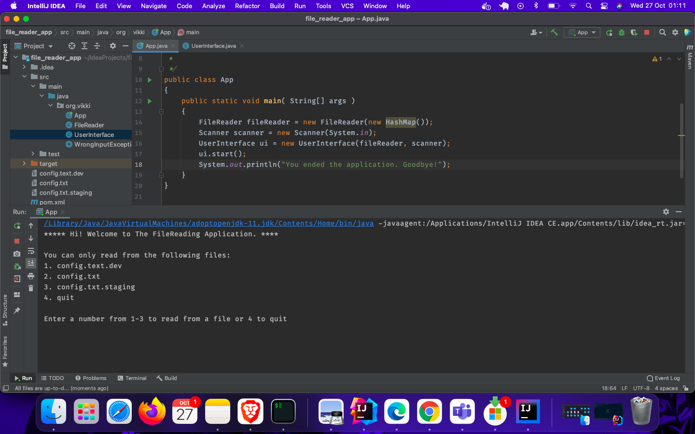

## FileReading Application
This is a simple FileReading console Application that read lines then 
splits the line and saves it as a key value pair in a HashMap.
####This is what it actually looks like

Clone this repo and have fun with it.